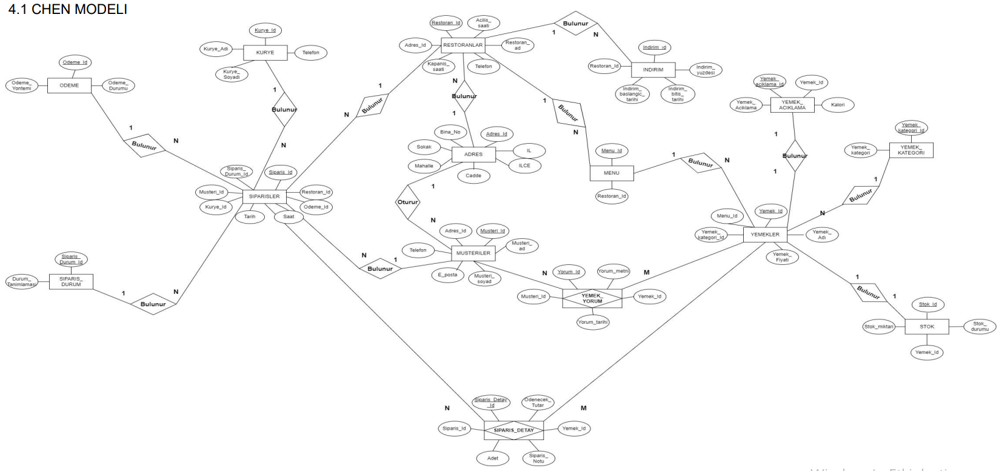
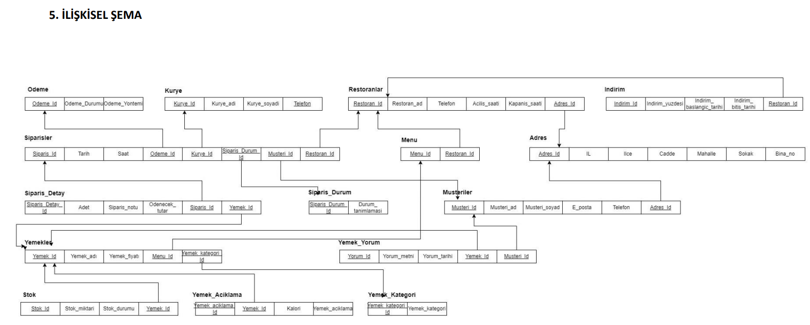
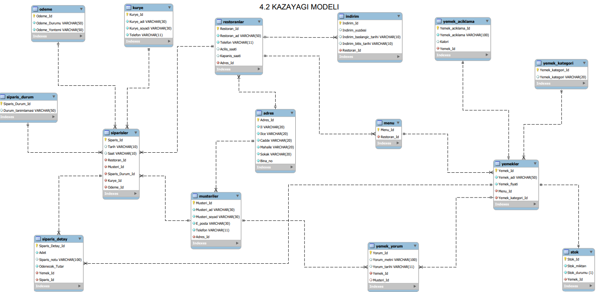

## OnlineYemekHizmetleriVeritabaniTasarimi
# 1.PROJENİN TANIMI
 Online yemek hizmetleri veritabanını kullanarak kullanıcıların 
restoranlardan yemek siparişi verebilecekleri bir web uygulaması 
oluşturulmak istenmiştir. Bu veritabanı, işletmenin müşterileri, 
restoranları, menüleri, yemekleri, stokları, indirimleri, kuryeleri, 
siparişleri ve ödemeleri gibi çeşitli bilgileri yönetebilmesini sağlar. 
Ayrıca yemek kategorileri, yemek açıklamaları ve yemek yorumları gibi 
detaylı bilgiler de saklanabilir. Böylece işletme, müşterilerinin yemek 
siparişi vermesi, ödeme yapması, kurye ile teslimat yapması ve sipariş 
durumunu takip etmesi gibi işlemleri kolayca gerçekleştirebilir.
 Projeyi hazırlarken Yemeksepeti şirketinde Bilgi İşlem departmanında 
çalışan Seda Hanım’dan veritabanı tasarımları ile ilgili bilgi aldım.
 
 # 2.GEREKSİNİM ANALİZİ
  •Amaç: Online yemek hizmeti sağlayan bir platform oluşturmak 
istiyoruz. Bu amaç doğrultusunda, kullanıcıların yemek siparişi 
vermesini, restoranların yemeklerini listelemesini ve kuryelerin 
siparişleri teslim etmesini sağlayacak bir veritabanı oluşturmayı 
hedefliyoruz.
  •Sistemin özellikleri ;
  Kullanıcılar: Sisteme kayıtlı olan kullanıcılar, online olarak yemek 
siparişi verebileceklerdir. Kullanıcıların ad, soyad, e-posta, telefon 
numarası gibi bilgileri sistemde tutulacaktır.
  Restoranlar: Sisteme kayıtlı olan restoranlar, yemeklerini listelemek ve 
siparişleri almaktan sorumlu olacaklardır. Restoranların adı, adresi, 
telefon numarası, açılış ve kapanış saatleri gibi bilgileri sisteme 
kaydedilecektir.
  Menüler: Restoranların menüleri, yemek kategorileri ve fiyatları gibi 
bilgilerle birlikte sisteme kaydedilecektir.
  Stok yönetimi: Restoranların yemeklerinin stok durumları, sisteme 
kaydedilecek ve stokta bulunmayan yemeklerin sipariş alınması 
engellenecektir.
  Siparişler: Kullanıcıların restoranlardan verdiği siparişler, sisteme 
kaydedilecektir. Siparişlerin tarihi, saati, teslimat adresi, ödeme 
yöntemi ve durumu gibi bilgiler de sisteme kaydedilecektir.
  Kuryeler: Siparişleri teslim etmekle görevli olan kuryelerin bilgileri 
sisteme kaydedilecektir.
  Ödemeler: Siparişlerin ödeme yöntemleri ve ödeme durumları da 
sisteme kaydedilecektir.
  İndirimler: Restoranların belirli tarihler arasında uygulayacakları 
indirimler de sistemde tanımlanacak ve kullanıcılar tarafından 
görülebilecektir.
  Yorumlar: Kullanıcılar, restoranlarda yedikleri yemekler hakkında 
yorumlar yazabileceklerdir. Yorumlar, sisteme kaydedilecek ve diğer 
kullanıcılar tarafından okunabilecektir.
  •Yetkilendirme ;
Sisteme kayıtlı kullanıcıların, yalnızca kendi hesaplarına erişebilmesi ve 
kendi siparişlerini görüntüleyebilmesi sağlanacaktır. Restoranların ise 
kendi menülerini düzenleyebilmesi ve siparişleri yönetebilmesi 
sağlanacaktır.
  •Güvenlik ;
Sistemin güvenliği için kullanıcıların kişisel bilgileri ve ödeme bilgileri 
şifrelenerek saklanacaktır.

 # 3. İŞ KURALLARI
 • Adres-Müşteriler(1:N)
  -Bir adreste birden çok müşteri bulunur.
  -Her müşterinin yalnızca bir adresi bulunur.
  • Adres-Restoranlar(1:N)
  -Bir adreste birden çok restoran bulunur.
  -Her restoranın yalnızca bir adresi bulunur.
  •Menü-Yemekler(1:N)
  -Bir restoranın birden fazla menüsü olabilir.
  -Her menü bir restorana aittir.
  •Yemekler-Yemek Kategori (N:1)
  -Her yemeğin bir kategorisi bulunur.
  -Yemek kategorisinde birden fazla yemek bulunabilir.
  •Yemekler-Yemek Açıklama (1:1)
  -Bir yemeğin bir açıklaması olur.
  •Müşteriler-Sipariş (1:N)
  -Bir müşteri birden fazla sipariş verebilir.
  -Her sipariş yalnızca bir müşteri tarafından verilebilir.
  •Restoranlar-Sipariş (1:N)
  -Bir restoran birden fazla sipariş alabilir.
  -Her sipariş yalnızca bir restoran için verilebilir.
  •Sipariş-Ödeme (N:1)
  -Her sipariş yalnızca bir ödeme yöntemi ile ilişkilendirilebilir.
  -Bir ödeme yöntemi birden çok siparişle ilişkilendirilebilir.
  •Sipariş-Kurye (N:1)
  -Her sipariş yalnızca bir kurye ile ilişkilendirilebilir.
  -Bir kurye birden çok siparişle ilişkilendirilebilir.
  •Sipariş-Yemekler (N:M)
  -Bir yemeğin birden fazla sipariş detayı(ara tablo) olabilir.
  -Bir siparişin birden fazla sipariş detayı(ara tablo) olabilir.
  •Müşteriler-Yemekler (N:M)
  -Bir müşterinin birden fazla yemek yorumu(ara tablo) olabilir.
  -Bir yemeğin birden fazla yemek yorumu(ara tablo) olabilir.
  • Siparişler -Kurye(N:1)
  - Her sipariş yalnızca bir kuryeyle ilişkilendirilebilir.
  - Bir kuryenin birden fazla siparişi olabilir.
  • Yemekler -Stok(1:1)
  -Bir yemeğin bir stok bilgisi bulunur.
  • Restoranlar-İndirim(1:N)
  - Bir restoranda birden fazla indirim olabilir.
  - Her indirim bir restoranla ilişkilendirilebilir.

 
